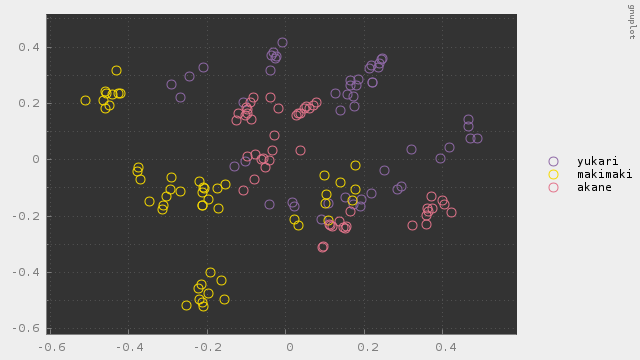
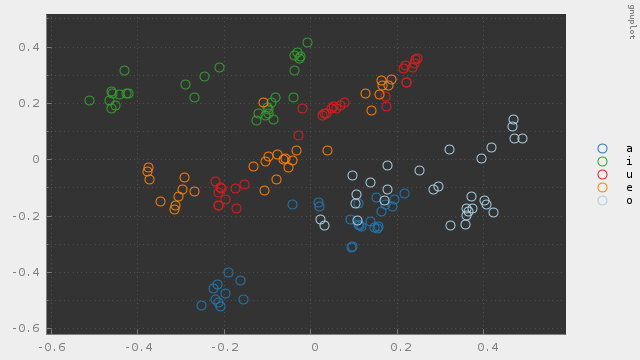

# phonetic

Phonetic recognition using SVM & MFCC

---

#### これは何？

MFCCとSVMで音声認識してみた実験コードです。全てC++によるフルスクラッチです。

#### 実験

ボイスロイド3人の音声データで訓練し、以下の音声認識を実験してみました。
- 音素識別: あいうえおの5クラスに分類
- 話者識別: ゆかり・マキマキ・茜の3クラスに分類

用意したデータでは accuracy は 90% 程度でした。  

MFCCは12次元ベクトルのためそのままではプロットできません。  
そこで主成分分析で2次元に削減し、プロットしてみました。  

##### 話者別

##### あいうえお別

